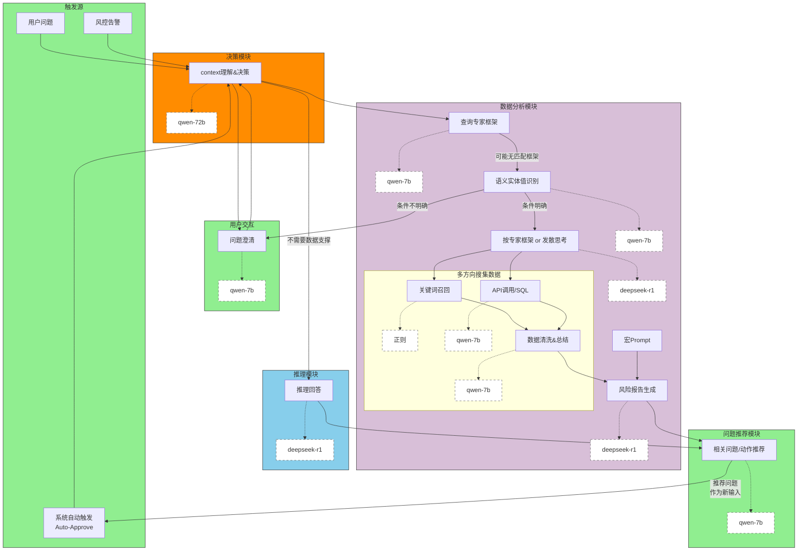

<svg xmlns="http://www.w3.org/2000/svg" xmlns:xlink="http://www.w3.org/1999/xlink" contentStyleType="text/css" data-diagram-type="DESCRIPTION" height="912px" preserveAspectRatio="none" style="width:1325px;height:912px;background:#FFFFFF;" version="1.1" viewBox="0 0 1325 912" width="1325px" zoomAndPan="magnify"><defs/><g><!--cluster ???--><g id="cluster_&#35302;&#21457;&#28304;"><rect fill="#90EE90" height="129.59" rx="7.5" ry="7.5" style="stroke:#000000;stroke-width:1;" width="430" x="46.67" y="307.48"/><text fill="#000000" font-family="Arial" font-size="14" font-style="italic" lengthAdjust="spacing" textLength="70.793" x="226.2735" y="322.4751">&#171;Process&#187;</text><text fill="#000000" font-family="Arial" font-size="14" font-weight="bold" lengthAdjust="spacing" textLength="41.9998" x="240.6701" y="338.772">&#35302;&#21457;&#28304;</text></g><!--cluster ????--><g id="cluster_&#29992;&#25143;&#20132;&#20114;"><rect fill="#90EE90" height="113.3" rx="7.5" ry="7.5" style="stroke:#000000;stroke-width:1;" width="241" x="500.67" y="315.62"/><text fill="#000000" font-family="Arial" font-size="14" font-style="italic" lengthAdjust="spacing" textLength="79.8096" x="581.2652" y="330.6151">&#171;Interface&#187;</text><text fill="#000000" font-family="Arial" font-size="14" font-weight="bold" lengthAdjust="spacing" textLength="55.9998" x="593.1701" y="346.912">&#29992;&#25143;&#20132;&#20114;</text></g><!--cluster ????--><g id="cluster_&#20915;&#31574;&#27169;&#22359;"><rect fill="#FF8C00" height="113.3" rx="7.5" ry="7.5" style="stroke:#000000;stroke-width:1;" width="313" x="311.67" y="470.07"/><text fill="#000000" font-family="Arial" font-size="14" font-style="italic" lengthAdjust="spacing" textLength="76.7334" x="429.8033" y="485.0651">&#171;Decision&#187;</text><text fill="#000000" font-family="Arial" font-size="14" font-weight="bold" lengthAdjust="spacing" textLength="55.9998" x="440.1701" y="501.362">&#20915;&#31574;&#27169;&#22359;</text></g><!--cluster ??????--><g id="cluster_&#25968;&#25454;&#20998;&#26512;&#27169;&#22359;"><rect fill="#D8BFD8" height="883.08" rx="7.5" ry="7.5" style="stroke:#000000;stroke-width:1;" width="554" x="765.67" y="23.88"/><text fill="#000000" font-family="Arial" font-size="14" font-style="italic" lengthAdjust="spacing" textLength="50.5586" x="1017.3907" y="38.8751">&#171;Data&#187;</text><text fill="#000000" font-family="Arial" font-size="14" font-weight="bold" lengthAdjust="spacing" textLength="83.9996" x="1000.6702" y="55.172">&#25968;&#25454;&#20998;&#26512;&#27169;&#22359;</text></g><!--cluster ???????--><g id="cluster_&#22810;&#26041;&#21521;&#25628;&#38598;&#25968;&#25454;"><rect fill="#FFFACD" height="290.59" rx="7.5" ry="7.5" style="stroke:#000000;stroke-width:1;" width="391" x="789.67" y="470.07"/><text fill="#000000" font-family="Arial" font-size="14" font-style="italic" lengthAdjust="spacing" textLength="95.9834" x="937.1783" y="485.0651">&#171;SubSystem&#187;</text><text fill="#000000" font-family="Arial" font-size="14" font-weight="bold" lengthAdjust="spacing" textLength="97.9996" x="936.1702" y="501.362">&#22810;&#26041;&#21521;&#25628;&#38598;&#25968;&#25454;</text></g><!--cluster ????--><g id="cluster_&#25512;&#29702;&#27169;&#22359;"><rect fill="#87CEEB" height="113.29" rx="7.5" ry="7.5" style="stroke:#000000;stroke-width:1;" width="265" x="343.67" y="647.37"/><text fill="#000000" font-family="Arial" font-size="14" font-style="italic" lengthAdjust="spacing" textLength="70.793" x="440.7735" y="662.3651">&#171;Process&#187;</text><text fill="#000000" font-family="Arial" font-size="14" font-weight="bold" lengthAdjust="spacing" textLength="55.9998" x="448.1701" y="678.662">&#25512;&#29702;&#27169;&#22359;</text></g><!--cluster ??????--><g id="cluster_&#38382;&#39064;&#25512;&#33616;&#27169;&#22359;"><rect fill="#90EE90" height="113.3" rx="7.5" ry="7.5" style="stroke:#000000;stroke-width:1;" width="301" x="313.67" y="793.66"/><text fill="#000000" font-family="Arial" font-size="14" font-style="italic" lengthAdjust="spacing" textLength="70.793" x="428.7735" y="808.6551">&#171;Process&#187;</text><text fill="#000000" font-family="Arial" font-size="14" font-weight="bold" lengthAdjust="spacing" textLength="83.9996" x="422.1702" y="824.952">&#38382;&#39064;&#25512;&#33616;&#27169;&#22359;</text></g><!--entity UserQ--><g id="elem_UserQ"><rect fill="#F1F1F1" height="46.2969" rx="2.5" ry="2.5" style="stroke:#181818;stroke-width:0.5;" width="95.9998" x="62.67" y="366.62"/><rect fill="#F1F1F1" height="10" style="stroke:#181818;stroke-width:0.5;" width="15" x="138.6698" y="371.62"/><rect fill="#F1F1F1" height="2" style="stroke:#181818;stroke-width:0.5;" width="4" x="136.6698" y="373.62"/><rect fill="#F1F1F1" height="2" style="stroke:#181818;stroke-width:0.5;" width="4" x="136.6698" y="377.62"/><text fill="#000000" font-family="Arial" font-size="14" lengthAdjust="spacing" textLength="55.9998" x="77.67" y="399.6151">&#29992;&#25143;&#38382;&#39064;</text></g><!--entity warnQ--><g id="elem_warnQ"><rect fill="#F1F1F1" height="46.2969" rx="2.5" ry="2.5" style="stroke:#181818;stroke-width:0.5;" width="95.9998" x="364.67" y="366.62"/><rect fill="#F1F1F1" height="10" style="stroke:#181818;stroke-width:0.5;" width="15" x="440.6698" y="371.62"/><rect fill="#F1F1F1" height="2" style="stroke:#181818;stroke-width:0.5;" width="4" x="438.6698" y="373.62"/><rect fill="#F1F1F1" height="2" style="stroke:#181818;stroke-width:0.5;" width="4" x="438.6698" y="377.62"/><text fill="#000000" font-family="Arial" font-size="14" lengthAdjust="spacing" textLength="55.9998" x="379.67" y="399.6151">&#39118;&#25511;&#21578;&#35686;</text></g><!--entity AutoQ--><g id="elem_AutoQ"><rect fill="#F1F1F1" height="62.5938" rx="2.5" ry="2.5" style="stroke:#181818;stroke-width:0.5;" width="136.127" x="193.61" y="358.48"/><rect fill="#F1F1F1" height="10" style="stroke:#181818;stroke-width:0.5;" width="15" x="309.737" y="363.48"/><rect fill="#F1F1F1" height="2" style="stroke:#181818;stroke-width:0.5;" width="4" x="307.737" y="365.48"/><rect fill="#F1F1F1" height="2" style="stroke:#181818;stroke-width:0.5;" width="4" x="307.737" y="369.48"/><text fill="#000000" font-family="Arial" font-size="14" lengthAdjust="spacing" textLength="83.9996" x="214.6737" y="391.4751">&#31995;&#32479;&#33258;&#21160;&#35302;&#21457;</text><text fill="#000000" font-family="Arial" font-size="14" lengthAdjust="spacing" textLength="96.127" x="208.61" y="407.772">Auto-Approve</text></g><!--entity QC--><g id="elem_QC"><rect fill="#F1F1F1" height="46.2969" rx="2.5" ry="2.5" style="stroke:#181818;stroke-width:0.5;" width="95.9998" x="516.67" y="366.62"/><rect fill="#F1F1F1" height="10" style="stroke:#181818;stroke-width:0.5;" width="15" x="592.6698" y="371.62"/><rect fill="#F1F1F1" height="2" style="stroke:#181818;stroke-width:0.5;" width="4" x="590.6698" y="373.62"/><rect fill="#F1F1F1" height="2" style="stroke:#181818;stroke-width:0.5;" width="4" x="590.6698" y="377.62"/><text fill="#000000" font-family="Arial" font-size="14" lengthAdjust="spacing" textLength="55.9998" x="531.67" y="399.6151">&#38382;&#39064;&#28548;&#28165;</text></g><g id="elem_GMN8"><path d="M648,377.21 L648,385.77 L612.8,389.77 L648,393.77 L648,402.3428 A0,0 0 0 0 648,402.3428 L725.3354,402.3428 A0,0 0 0 0 725.3354,402.3428 L725.3354,387.21 L715.3354,377.21 L648,377.21 A0,0 0 0 0 648,377.21 " fill="#FEFFDD" style="stroke:#181818;stroke-width:0.5;"/><path d="M715.3354,377.21 L715.3354,387.21 L725.3354,387.21 L715.3354,377.21 " fill="#FEFFDD" style="stroke:#181818;stroke-width:0.5;"/><text fill="#000000" font-family="Arial" font-size="13" lengthAdjust="spacing" textLength="56.3354" x="654" y="394.2769">qwen-7b</text></g><!--entity MultiTurn--><g id="elem_MultiTurn"><rect fill="#F1F1F1" height="46.2969" rx="2.5" ry="2.5" style="stroke:#181818;stroke-width:0.5;" width="159.9294" x="327.71" y="521.07"/><rect fill="#F1F1F1" height="10" style="stroke:#181818;stroke-width:0.5;" width="15" x="467.6394" y="526.07"/><rect fill="#F1F1F1" height="2" style="stroke:#181818;stroke-width:0.5;" width="4" x="465.6394" y="528.07"/><rect fill="#F1F1F1" height="2" style="stroke:#181818;stroke-width:0.5;" width="4" x="465.6394" y="532.07"/><text fill="#000000" font-family="Arial" font-size="14" lengthAdjust="spacing" textLength="119.9294" x="342.71" y="554.0651">context&#29702;&#35299;&amp;&#20915;&#31574;</text></g><g id="elem_GMN13"><path d="M522.87,531.65 L522.87,540.22 L487.9,544.22 L522.87,548.22 L522.87,556.7828 A0,0 0 0 0 522.87,556.7828 L608.4764,556.7828 A0,0 0 0 0 608.4764,556.7828 L608.4764,541.65 L598.4764,531.65 L522.87,531.65 A0,0 0 0 0 522.87,531.65 " fill="#FEFFDD" style="stroke:#181818;stroke-width:0.5;"/><path d="M598.4764,531.65 L598.4764,541.65 L608.4764,541.65 L598.4764,531.65 " fill="#FEFFDD" style="stroke:#181818;stroke-width:0.5;"/><text fill="#000000" font-family="Arial" font-size="13" lengthAdjust="spacing" textLength="64.6064" x="528.87" y="548.7169">qwen-72b</text></g><!--entity ExpertFrame--><g id="elem_ExpertFrame"><rect fill="#F1F1F1" height="46.2969" rx="2.5" ry="2.5" style="stroke:#181818;stroke-width:0.5;" width="123.9996" x="894.67" y="74.88"/><rect fill="#F1F1F1" height="10" style="stroke:#181818;stroke-width:0.5;" width="15" x="998.6696" y="79.88"/><rect fill="#F1F1F1" height="2" style="stroke:#181818;stroke-width:0.5;" width="4" x="996.6696" y="81.88"/><rect fill="#F1F1F1" height="2" style="stroke:#181818;stroke-width:0.5;" width="4" x="996.6696" y="85.88"/><text fill="#000000" font-family="Arial" font-size="14" lengthAdjust="spacing" textLength="83.9996" x="909.67" y="107.8751">&#26597;&#35810;&#19987;&#23478;&#26694;&#26550;</text></g><g id="elem_GMN18"><path d="M782,85.46 L782,110.5928 A0,0 0 0 0 782,110.5928 L859.3354,110.5928 A0,0 0 0 0 859.3354,110.5928 L859.3354,103.46 L894.18,98.03 L859.3354,95.46 L859.3354,95.46 L849.3354,85.46 L782,85.46 A0,0 0 0 0 782,85.46 " fill="#FEFFDD" style="stroke:#181818;stroke-width:0.5;"/><path d="M849.3354,85.46 L849.3354,95.46 L859.3354,95.46 L849.3354,85.46 " fill="#FEFFDD" style="stroke:#181818;stroke-width:0.5;"/><text fill="#000000" font-family="Arial" font-size="13" lengthAdjust="spacing" textLength="56.3354" x="788" y="102.5269">qwen-7b</text></g><!--entity DivergentThinking--><g id="elem_DivergentThinking"><rect fill="#F1F1F1" height="46.2969" rx="2.5" ry="2.5" style="stroke:#181818;stroke-width:0.5;" width="189.2211" x="822.06" y="366.62"/><rect fill="#F1F1F1" height="10" style="stroke:#181818;stroke-width:0.5;" width="15" x="991.2811" y="371.62"/><rect fill="#F1F1F1" height="2" style="stroke:#181818;stroke-width:0.5;" width="4" x="989.2811" y="373.62"/><rect fill="#F1F1F1" height="2" style="stroke:#181818;stroke-width:0.5;" width="4" x="989.2811" y="377.62"/><text fill="#000000" font-family="Arial" font-size="14" lengthAdjust="spacing" textLength="149.2211" x="837.06" y="399.6151">&#25353;&#19987;&#23478;&#26694;&#26550; or &#21457;&#25955;&#24605;&#32771;</text></g><g id="elem_GMN22"><path d="M1046.62,377.21 L1046.62,385.77 L1011.77,389.77 L1046.62,393.77 L1046.62,402.3428 A0,0 0 0 0 1046.62,402.3428 L1148.724,402.3428 A0,0 0 0 0 1148.724,402.3428 L1148.724,387.21 L1138.724,377.21 L1046.62,377.21 A0,0 0 0 0 1046.62,377.21 " fill="#FEFFDD" style="stroke:#181818;stroke-width:0.5;"/><path d="M1138.724,377.21 L1138.724,387.21 L1148.724,387.21 L1138.724,377.21 " fill="#FEFFDD" style="stroke:#181818;stroke-width:0.5;"/><text fill="#000000" font-family="Arial" font-size="13" lengthAdjust="spacing" textLength="81.104" x="1052.62" y="394.2769">deepseek-r1</text></g><!--entity EntityRecog--><g id="elem_EntityRecog"><rect fill="#F1F1F1" height="46.2969" rx="2.5" ry="2.5" style="stroke:#181818;stroke-width:0.5;" width="137.9996" x="847.67" y="198.18"/><rect fill="#F1F1F1" height="10" style="stroke:#181818;stroke-width:0.5;" width="15" x="965.6696" y="203.18"/><rect fill="#F1F1F1" height="2" style="stroke:#181818;stroke-width:0.5;" width="4" x="963.6696" y="205.18"/><rect fill="#F1F1F1" height="2" style="stroke:#181818;stroke-width:0.5;" width="4" x="963.6696" y="209.18"/><text fill="#000000" font-family="Arial" font-size="14" lengthAdjust="spacing" textLength="97.9996" x="862.67" y="231.1751">&#35821;&#20041;&#23454;&#20307;&#20540;&#35782;&#21035;</text></g><g id="elem_GMN26"><path d="M1021,208.76 L1021,217.33 L985.94,221.33 L1021,225.33 L1021,233.8928 A0,0 0 0 0 1021,233.8928 L1098.3354,233.8928 A0,0 0 0 0 1098.3354,233.8928 L1098.3354,218.76 L1088.3354,208.76 L1021,208.76 A0,0 0 0 0 1021,208.76 " fill="#FEFFDD" style="stroke:#181818;stroke-width:0.5;"/><path d="M1088.3354,208.76 L1088.3354,218.76 L1098.3354,218.76 L1088.3354,208.76 " fill="#FEFFDD" style="stroke:#181818;stroke-width:0.5;"/><text fill="#000000" font-family="Arial" font-size="13" lengthAdjust="spacing" textLength="56.3354" x="1027" y="225.8269">qwen-7b</text></g><!--entity UserIdentity--><g id="elem_UserIdentity"><rect fill="#F1F1F1" height="46.2969" rx="2.5" ry="2.5" style="stroke:#181818;stroke-width:0.5;" width="104.7773" x="1199.28" y="698.37"/><rect fill="#F1F1F1" height="10" style="stroke:#181818;stroke-width:0.5;" width="15" x="1284.0573" y="703.37"/><rect fill="#F1F1F1" height="2" style="stroke:#181818;stroke-width:0.5;" width="4" x="1282.0573" y="705.37"/><rect fill="#F1F1F1" height="2" style="stroke:#181818;stroke-width:0.5;" width="4" x="1282.0573" y="709.37"/><text fill="#000000" font-family="Arial" font-size="14" lengthAdjust="spacing" textLength="64.7773" x="1214.28" y="731.3651">&#23439;Prompt</text></g><!--entity ReportGen--><g id="elem_ReportGen"><rect fill="#F1F1F1" height="46.2969" rx="2.5" ry="2.5" style="stroke:#181818;stroke-width:0.5;" width="123.9996" x="810.67" y="844.66"/><rect fill="#F1F1F1" height="10" style="stroke:#181818;stroke-width:0.5;" width="15" x="914.6696" y="849.66"/><rect fill="#F1F1F1" height="2" style="stroke:#181818;stroke-width:0.5;" width="4" x="912.6696" y="851.66"/><rect fill="#F1F1F1" height="2" style="stroke:#181818;stroke-width:0.5;" width="4" x="912.6696" y="855.66"/><text fill="#000000" font-family="Arial" font-size="14" lengthAdjust="spacing" textLength="83.9996" x="825.67" y="877.6551">&#39118;&#38505;&#25253;&#21578;&#29983;&#25104;</text></g><g id="elem_GMN44"><path d="M969.62,855.25 L969.62,863.81 L935.11,867.81 L969.62,871.81 L969.62,880.3828 A0,0 0 0 0 969.62,880.3828 L1071.724,880.3828 A0,0 0 0 0 1071.724,880.3828 L1071.724,865.25 L1061.724,855.25 L969.62,855.25 A0,0 0 0 0 969.62,855.25 " fill="#FEFFDD" style="stroke:#181818;stroke-width:0.5;"/><path d="M1061.724,855.25 L1061.724,865.25 L1071.724,865.25 L1061.724,855.25 " fill="#FEFFDD" style="stroke:#181818;stroke-width:0.5;"/><text fill="#000000" font-family="Arial" font-size="13" lengthAdjust="spacing" textLength="81.104" x="975.62" y="872.3169">deepseek-r1</text></g><!--entity Keywords--><g id="elem_Keywords"><rect fill="#F1F1F1" height="46.2969" rx="2.5" ry="2.5" style="stroke:#181818;stroke-width:0.5;" width="109.9997" x="805.67" y="521.07"/><rect fill="#F1F1F1" height="10" style="stroke:#181818;stroke-width:0.5;" width="15" x="895.6697" y="526.07"/><rect fill="#F1F1F1" height="2" style="stroke:#181818;stroke-width:0.5;" width="4" x="893.6697" y="528.07"/><rect fill="#F1F1F1" height="2" style="stroke:#181818;stroke-width:0.5;" width="4" x="893.6697" y="532.07"/><text fill="#000000" font-family="Arial" font-size="14" lengthAdjust="spacing" textLength="69.9997" x="820.67" y="554.0651">&#20851;&#38190;&#35789;&#21484;&#22238;</text></g><g id="elem_GMN31"><path d="M950.17,531.65 L950.17,540.22 L915.85,544.22 L950.17,548.22 L950.17,556.7828 A0,0 0 0 0 950.17,556.7828 L997.17,556.7828 A0,0 0 0 0 997.17,556.7828 L997.17,541.65 L987.17,531.65 L950.17,531.65 A0,0 0 0 0 950.17,531.65 " fill="#FEFFDD" style="stroke:#181818;stroke-width:0.5;"/><path d="M987.17,531.65 L987.17,541.65 L997.17,541.65 L987.17,531.65 " fill="#FEFFDD" style="stroke:#181818;stroke-width:0.5;"/><text fill="#000000" font-family="Arial" font-size="13" lengthAdjust="spacing" textLength="26" x="956.17" y="548.7169">&#27491;&#21017;</text></g><!--entity APICall--><g id="elem_APICall"><rect fill="#F1F1F1" height="46.2969" rx="2.5" ry="2.5" style="stroke:#181818;stroke-width:0.5;" width="122.5712" x="1032.38" y="521.07"/><rect fill="#F1F1F1" height="10" style="stroke:#181818;stroke-width:0.5;" width="15" x="1134.9512" y="526.07"/><rect fill="#F1F1F1" height="2" style="stroke:#181818;stroke-width:0.5;" width="4" x="1132.9512" y="528.07"/><rect fill="#F1F1F1" height="2" style="stroke:#181818;stroke-width:0.5;" width="4" x="1132.9512" y="532.07"/><text fill="#000000" font-family="Arial" font-size="14" lengthAdjust="spacing" textLength="82.5712" x="1047.38" y="554.0651">API&#35843;&#29992;/SQL</text></g><g id="elem_GMN35"><path d="M975,708.95 L975,734.0828 A0,0 0 0 0 975,734.0828 L1052.3354,734.0828 A0,0 0 0 0 1052.3354,734.0828 L1052.3354,718.95 L1042.3354,708.95 L1023,708.95 L1083.38,567.78 L1015,708.95 L975,708.95 A0,0 0 0 0 975,708.95 " fill="#FEFFDD" style="stroke:#181818;stroke-width:0.5;"/><path d="M1042.3354,708.95 L1042.3354,718.95 L1052.3354,718.95 L1042.3354,708.95 " fill="#FEFFDD" style="stroke:#181818;stroke-width:0.5;"/><text fill="#000000" font-family="Arial" font-size="13" lengthAdjust="spacing" textLength="56.3354" x="981" y="726.0169">qwen-7b</text></g><!--entity DataAssembly--><g id="elem_DataAssembly"><rect fill="#F1F1F1" height="46.2969" rx="2.5" ry="2.5" style="stroke:#181818;stroke-width:0.5;" width="134.9166" x="805.21" y="698.37"/><rect fill="#F1F1F1" height="10" style="stroke:#181818;stroke-width:0.5;" width="15" x="920.1266" y="703.37"/><rect fill="#F1F1F1" height="2" style="stroke:#181818;stroke-width:0.5;" width="4" x="918.1266" y="705.37"/><rect fill="#F1F1F1" height="2" style="stroke:#181818;stroke-width:0.5;" width="4" x="918.1266" y="709.37"/><text fill="#000000" font-family="Arial" font-size="14" lengthAdjust="spacing" textLength="94.9166" x="820.21" y="731.3651">&#25968;&#25454;&#28165;&#27927;&amp;&#24635;&#32467;</text></g><g id="elem_GMN39"><path d="M1087,708.95 L1087,734.0828 L1164.3354,734.0828 L1164.3354,718.95 L1154.3354,708.95 L1087,708.95 " fill="#FEFFDD" style="stroke:#181818;stroke-width:0.5;"/><path d="M1154.3354,708.95 L1154.3354,718.95 L1164.3354,718.95 L1154.3354,708.95 " fill="#FEFFDD" style="stroke:#181818;stroke-width:1;"/><text fill="#000000" font-family="Arial" font-size="13" lengthAdjust="spacing" textLength="56.3354" x="1093" y="726.0169">qwen-7b</text></g><!--entity Reasoning--><g id="elem_Reasoning"><rect fill="#F1F1F1" height="46.2969" rx="2.5" ry="2.5" style="stroke:#181818;stroke-width:0.5;" width="95.9998" x="359.67" y="698.37"/><rect fill="#F1F1F1" height="10" style="stroke:#181818;stroke-width:0.5;" width="15" x="435.6698" y="703.37"/><rect fill="#F1F1F1" height="2" style="stroke:#181818;stroke-width:0.5;" width="4" x="433.6698" y="705.37"/><rect fill="#F1F1F1" height="2" style="stroke:#181818;stroke-width:0.5;" width="4" x="433.6698" y="709.37"/><text fill="#000000" font-family="Arial" font-size="14" lengthAdjust="spacing" textLength="55.9998" x="374.67" y="731.3651">&#25512;&#29702;&#22238;&#31572;</text></g><g id="elem_GMN49"><path d="M490.62,708.95 L490.62,717.51 L456.09,721.51 L490.62,725.51 L490.62,734.0828 A0,0 0 0 0 490.62,734.0828 L592.724,734.0828 A0,0 0 0 0 592.724,734.0828 L592.724,718.95 L582.724,708.95 L490.62,708.95 A0,0 0 0 0 490.62,708.95 " fill="#FEFFDD" style="stroke:#181818;stroke-width:0.5;"/><path d="M582.724,708.95 L582.724,718.95 L592.724,718.95 L582.724,708.95 " fill="#FEFFDD" style="stroke:#181818;stroke-width:0.5;"/><text fill="#000000" font-family="Arial" font-size="13" lengthAdjust="spacing" textLength="81.104" x="496.62" y="726.0169">deepseek-r1</text></g><!--entity Recommendation--><g id="elem_Recommendation"><rect fill="#F1F1F1" height="46.2969" rx="2.5" ry="2.5" style="stroke:#181818;stroke-width:0.5;" width="156.7163" x="329.31" y="844.66"/><rect fill="#F1F1F1" height="10" style="stroke:#181818;stroke-width:0.5;" width="15" x="466.0263" y="849.66"/><rect fill="#F1F1F1" height="2" style="stroke:#181818;stroke-width:0.5;" width="4" x="464.0263" y="851.66"/><rect fill="#F1F1F1" height="2" style="stroke:#181818;stroke-width:0.5;" width="4" x="464.0263" y="855.66"/><text fill="#000000" font-family="Arial" font-size="14" lengthAdjust="spacing" textLength="116.7163" x="344.31" y="877.6551">&#30456;&#20851;&#38382;&#39064;/&#21160;&#20316;&#25512;&#33616;</text></g><g id="elem_GMN54"><path d="M521,855.25 L521,863.81 L486.34,867.81 L521,871.81 L521,880.3828 A0,0 0 0 0 521,880.3828 L598.3354,880.3828 A0,0 0 0 0 598.3354,880.3828 L598.3354,865.25 L588.3354,855.25 L521,855.25 A0,0 0 0 0 521,855.25 " fill="#FEFFDD" style="stroke:#181818;stroke-width:0.5;"/><path d="M588.3354,855.25 L588.3354,865.25 L598.3354,865.25 L588.3354,855.25 " fill="#FEFFDD" style="stroke:#181818;stroke-width:0.5;"/><text fill="#000000" font-family="Arial" font-size="13" lengthAdjust="spacing" textLength="56.3354" x="527" y="872.3169">qwen-7b</text></g><!--link DataAssembly to GMN39--><g id="link_DataAssembly_GMN39"><path d="M886.94,698.01 C904.17,672.16 935.79,632.08 975.17,615.37 C1006.67,601.99 1021.66,599.86 1052.17,615.37 C1090.53,634.87 1112.7,684.83 1121.38,708.59 " fill="#FFFFFF" fill-opacity="0.00000" id="DataAssembly-GMN39" style="stroke:#181818;stroke-width:1;stroke-dasharray:7.0,7.0;"/></g><!--link UserQ to MultiTurn--><g id="link_UserQ_MultiTurn"><path d="M134.06,413.21 C145.89,423.79 160.86,436.03 175.67,445.07 C227.84,476.91 286.5412,501.1897 334.2312,518.5297 " fill="#FFFFFF" fill-opacity="0.00000" id="UserQ-to-MultiTurn" style="stroke:#181818;stroke-width:1;"/><polygon fill="#181818" points="339.87,520.58,332.7786,513.7454,335.171,518.8714,330.0449,521.2638,339.87,520.58" style="stroke:#181818;stroke-width:1;"/></g><!--link AutoQ to MultiTurn--><g id="link_AutoQ_MultiTurn"><path d="M290.86,421.26 C318.99,450.62 356.7405,490.0362 381.9605,516.3762 " fill="#FFFFFF" fill-opacity="0.00000" id="AutoQ-to-MultiTurn" style="stroke:#181818;stroke-width:1;"/><polygon fill="#181818" points="386.11,520.71,382.7749,511.443,382.6521,517.0985,376.9966,516.9757,386.11,520.71" style="stroke:#181818;stroke-width:1;"/></g><!--link warnQ to MultiTurn--><g id="link_warnQ_MultiTurn"><path d="M411.93,413.27 C410.99,442.09 409.5573,485.7632 408.6073,514.6332 " fill="#FFFFFF" fill-opacity="0.00000" id="warnQ-to-MultiTurn" style="stroke:#181818;stroke-width:1;"/><polygon fill="#181818" points="408.41,520.63,412.7038,511.7664,408.5744,515.6327,404.7082,511.5033,408.41,520.63" style="stroke:#181818;stroke-width:1;"/></g><!--link MultiTurn to QC--><g id="link_MultiTurn_QC"><path d="M431.96,520.74 C451.16,503.57 479.07,479.91 505.67,462.07 C511.94,457.86 515.02,459.09 520.67,454.07 C533.67,442.51 541.7429,431.5209 549.5629,418.4309 " fill="#FFFFFF" fill-opacity="0.00000" id="MultiTurn-to-QC" style="stroke:#181818;stroke-width:1;"/><polygon fill="#181818" points="552.64,413.28,544.5904,418.9549,550.0757,417.5724,551.4582,423.0577,552.64,413.28" style="stroke:#181818;stroke-width:1;"/></g><!--link QC to MultiTurn--><g id="link_QC_MultiTurn"><path d="M541.5,413.27 C511.82,442.09 464.9644,487.5801 435.2344,516.4501 " fill="#FFFFFF" fill-opacity="0.00000" id="QC-to-MultiTurn" style="stroke:#181818;stroke-width:1;"/><polygon fill="#181818" points="430.93,520.63,440.1733,517.2297,434.517,517.1467,434.6,511.4905,430.93,520.63" style="stroke:#181818;stroke-width:1;"/></g><!--link MultiTurn to ExpertFrame--><g id="link_MultiTurn_ExpertFrame"><path d="M327.53,532.78 C231.89,518.5 80.59,489.45 46.67,445.07 C7.37,393.66 6,349.81 46.67,299.48 C283.8,6 510.26,211.17 876.67,121.18 C882.41,119.77 882.5586,119.7708 888.5086,118.2008 " fill="#FFFFFF" fill-opacity="0.00000" id="MultiTurn-to-ExpertFrame" style="stroke:#181818;stroke-width:1;"/><polygon fill="#181818" points="894.31,116.67,884.5873,115.0986,889.4755,117.9457,886.6284,122.8338,894.31,116.67" style="stroke:#181818;stroke-width:1;"/><text fill="#000000" font-family="Arial" font-size="13" lengthAdjust="spacing" textLength="78.0001" x="63.67" y="287.5469">&#38656;&#35201;&#25968;&#25454;&#25903;&#25745;</text></g><!--link MultiTurn to Reasoning--><g id="link_MultiTurn_Reasoning"><path d="M407.67,567.78 C407.67,601.44 407.67,658.43 407.67,692.04 " fill="#FFFFFF" fill-opacity="0.00000" id="MultiTurn-to-Reasoning" style="stroke:#181818;stroke-width:1;"/><polygon fill="#181818" points="407.67,698.04,411.67,689.04,407.67,693.04,403.67,689.04,407.67,698.04" style="stroke:#181818;stroke-width:1;"/><text fill="#000000" font-family="Arial" font-size="13" lengthAdjust="spacing" textLength="91.0001" x="408.67" y="619.9369">&#19981;&#38656;&#35201;&#25968;&#25454;&#25903;&#25745;</text></g><!--link ExpertFrame to EntityRecog--><g id="link_ExpertFrame_EntityRecog"><path d="M949.24,121.56 C942.06,143.35 933.1085,170.4716 925.9385,192.2216 " fill="#FFFFFF" fill-opacity="0.00000" id="ExpertFrame-to-EntityRecog" style="stroke:#181818;stroke-width:1;"/><polygon fill="#181818" points="924.06,197.92,930.6766,190.6248,925.6254,193.1714,923.0788,188.1201,924.06,197.92" style="stroke:#181818;stroke-width:1;"/><text fill="#000000" font-family="Arial" font-size="13" lengthAdjust="spacing" textLength="91.0001" x="939.67" y="164.2469">&#21487;&#33021;&#26080;&#21305;&#37197;&#26694;&#26550;</text></g><!--link EntityRecog to DivergentThinking--><g id="link_EntityRecog_DivergentThinking"><path d="M916.67,244.77 C916.67,276.54 916.67,328.29 916.67,360.15 " fill="#FFFFFF" fill-opacity="0.00000" id="EntityRecog-to-DivergentThinking" style="stroke:#181818;stroke-width:1;"/><polygon fill="#181818" points="916.67,366.15,920.67,357.15,916.67,361.15,912.67,357.15,916.67,366.15" style="stroke:#181818;stroke-width:1;"/><text fill="#000000" font-family="Arial" font-size="13" lengthAdjust="spacing" textLength="52.0001" x="917.67" y="287.5469">&#26465;&#20214;&#26126;&#30830;</text></g><!--link EntityRecog to QC--><g id="link_EntityRecog_QC"><path d="M847.2,228.12 C785.71,236.1 695.87,254.97 630.67,299.48 C605.83,316.43 589.6295,340.6107 578.5095,361.0307 " fill="#FFFFFF" fill-opacity="0.00000" id="EntityRecog-to-QC" style="stroke:#181818;stroke-width:1;"/><polygon fill="#181818" points="575.64,366.3,583.4571,360.309,578.0312,361.9089,576.4313,356.483,575.64,366.3" style="stroke:#181818;stroke-width:1;"/><text fill="#000000" font-family="Arial" font-size="13" lengthAdjust="spacing" textLength="65.0001" x="672.67" y="287.5469">&#26465;&#20214;&#19981;&#26126;&#30830;</text></g><!--link DivergentThinking to Keywords--><g id="link_DivergentThinking_Keywords"><path d="M908.41,413.27 C897.82,442.09 881.638,486.1276 871.038,514.9976 " fill="#FFFFFF" fill-opacity="0.00000" id="DivergentThinking-to-Keywords" style="stroke:#181818;stroke-width:1;"/><polygon fill="#181818" points="868.97,520.63,875.8269,513.5601,870.6933,515.9364,868.3171,510.8028,868.97,520.63" style="stroke:#181818;stroke-width:1;"/></g><!--link DivergentThinking to APICall--><g id="link_DivergentThinking_APICall"><path d="M950.4,413.2 C969.81,426.61 994.31,444.44 1014.67,462.07 C1036.07,480.61 1054.3417,499.5415 1069.7817,516.4315 " fill="#FFFFFF" fill-opacity="0.00000" id="DivergentThinking-to-APICall" style="stroke:#181818;stroke-width:1;"/><polygon fill="#181818" points="1073.83,520.86,1070.7099,511.5184,1070.4564,517.1696,1064.8053,516.9162,1073.83,520.86" style="stroke:#181818;stroke-width:1;"/></g><!--link Keywords to DataAssembly--><g id="link_Keywords_DataAssembly"><path d="M862.21,567.78 C864.52,601.44 868.4204,658.444 870.7204,692.054 " fill="#FFFFFF" fill-opacity="0.00000" id="Keywords-to-DataAssembly" style="stroke:#181818;stroke-width:1;"/><polygon fill="#181818" points="871.13,698.04,874.5062,688.7879,870.7886,693.0517,866.5249,689.3341,871.13,698.04" style="stroke:#181818;stroke-width:1;"/></g><!--link APICall to DataAssembly--><g id="link_APICall_DataAssembly"><path d="M1057.92,567.76 C1029.83,585.98 990.17,612.88 957.67,639.37 C934.9,657.93 915.066,677.0109 898.386,693.9009 " fill="#FFFFFF" fill-opacity="0.00000" id="APICall-to-DataAssembly" style="stroke:#181818;stroke-width:1;"/><polygon fill="#181818" points="894.17,698.17,903.3401,694.577,897.6833,694.6124,897.648,688.9557,894.17,698.17" style="stroke:#181818;stroke-width:1;"/></g><!--link DataAssembly to ReportGen--><g id="link_DataAssembly_ReportGen"><path d="M872.67,745.06 C872.67,772.17 872.67,811.39 872.67,838.42 " fill="#FFFFFF" fill-opacity="0.00000" id="DataAssembly-to-ReportGen" style="stroke:#181818;stroke-width:1;"/><polygon fill="#181818" points="872.67,844.42,876.67,835.42,872.67,839.42,868.67,835.42,872.67,844.42" style="stroke:#181818;stroke-width:1;"/></g><!--link UserIdentity to ReportGen--><g id="link_UserIdentity_ReportGen"><path d="M1224.02,745.14 C1211.53,754.08 1196.13,763.45 1180.67,768.66 C1083.96,801.27 1044.16,742.52 951.67,785.66 C924.23,798.46 904.7297,820.3708 890.7497,839.6708 " fill="#FFFFFF" fill-opacity="0.00000" id="UserIdentity-to-ReportGen" style="stroke:#181818;stroke-width:1;"/><polygon fill="#181818" points="887.23,844.53,895.7491,839.5878,890.1631,840.4807,889.2702,834.8948,887.23,844.53" style="stroke:#181818;stroke-width:1;"/></g><!--link ReportGen to Recommendation--><g id="link_ReportGen_Recommendation"><path d="M818.99,844.21 C763.32,821.13 673.14,787.56 591.34,774.33 C563.11,769.76 554.87,767.92 527,774.33 C484.68,784.06 451.2771,815.5524 430.0771,839.9324 " fill="#FFFFFF" fill-opacity="0.00000" id="ReportGen-to-Recommendation" style="stroke:#181818;stroke-width:1;"/><polygon fill="#181818" points="426.14,844.46,435.064,840.2933,429.4209,840.687,429.0272,835.0438,426.14,844.46" style="stroke:#181818;stroke-width:1;"/></g><!--link Reasoning to Recommendation--><g id="link_Reasoning_Recommendation"><path d="M407.67,745.06 C407.67,772.17 407.67,811.39 407.67,838.42 " fill="#FFFFFF" fill-opacity="0.00000" id="Reasoning-to-Recommendation" style="stroke:#181818;stroke-width:1;"/><polygon fill="#181818" points="407.67,844.42,411.67,835.42,407.67,839.42,403.67,835.42,407.67,844.42" style="stroke:#181818;stroke-width:1;"/></g><!--link Recommendation to AutoQ--><g id="link_Recommendation_AutoQ"><path d="M389.6,844.36 C375.12,825.29 355.35,796.63 343.67,768.66 C292.49,646.17 272.0767,493.3972 265.1567,427.5072 " fill="#FFFFFF" fill-opacity="0.00000" id="Recommendation-to-AutoQ" style="stroke:#181818;stroke-width:1;"/><polygon fill="#181818" points="264.53,421.54,261.4919,430.9086,265.0522,426.5127,269.4482,430.073,264.53,421.54" style="stroke:#181818;stroke-width:1;"/><text fill="#000000" font-family="Arial" font-size="13" lengthAdjust="spacing" textLength="52.0001" x="307.17" y="612.4369">&#25512;&#33616;&#38382;&#39064;</text><text fill="#000000" font-family="Arial" font-size="13" lengthAdjust="spacing" textLength="65.0001" x="300.67" y="627.5697">&#20316;&#20026;&#26032;&#36755;&#20837;</text></g><!--SRC=[VLHhJnj75Fs-ls8IfFGJ2gbKXLGHal63MdM8UQcgaYfQsuEpOZthxgv3K1M9Ya082c02WQIyIWZWFcmZKL4U9R_6Erx_YzwPMTkpQvGlFEwvzvwpTywzDp9uN2COFGZ51vyy70uD3aHHLopM6-xfKMvuM28-yDtea_x4642zTyFHQ7y06XYEHWTHrxsUQFHUiEp7Q2Bny0VMCnOAHm9WScmucO2kaTx-MAHNKQm9ZUHLKyqXI5CBkXqpY3sevZ0AcPggT-AZ-BaTqhKioM5YepJymAQKPUAqhPAiZj4l2aBzXfd1PjZG3HEbT3KzmMBmAsiQ1P8HSLaqm1vY4coYEzyeBnIbtVAcUtJeBA_GY-9DTFz-qZJIsBBw-b1NbpmLHloelbQYy_ysDYgDZ-z_Ggg5nYni3Y46DVQNwDAHixBWbWyvDAcQH43raylwvQxxwazdeIIu7fDGmJQwG_cyQJp3F9q58DslJF3LBZxLBjuoSN4sbt4rZQ-N9uJHpo_fsInlEXHMY65ZP6hPfpOonY60laK_JsBIVJSLu7BcJkhbTLhQSxOt65S4fpLBCmYdact5gTBmeF1czUASUxH_IzHooWVmcjfemIGeGDq6cWg-3agWxuxfOiMPdwCxHKc8QglIztfUuohexe5R_LWxMtKgftGFoawvXkZpF3Rj63W72n4w7kSQ942Q0slqvhNS1O63c2NUxTFfRNTwXdUDQC-mcGLhZZxL25Wp6_Z03XmeCXZdBOmdkiqxZCQjbcldhvtAJkrgrPd-pwtEEVD_2Sd4rkofOPmsWcqbnAUPkLfwlK-_qVLpfxX2YrkDpJanIJQzaK9gPCgoSGv6o6O6AfpPayPQnQqkEij_EvixdFzxF3K9QsK5o9jXOARbVMV-W-WGIiRTunbmv-sHeOImRp8ULdLTbASCspPohDuB-uIpSNDvu5BwpyOjEWthiIf634yTiYoSI-bJmUbAaDpjXHZ58wUo3AkRozkjlOndC1-TjvsD3t_GXGDOqFhQBfqlyhHXd3TCUm2J05ahxd_1W5kNIc3_jayxBmS_jSAeF1U6NI-lUSogPP1E4xNYNsBszdofv2uMlyGlNwxDC_RilF0stA7QrPQezzIaZHoStengmyPtI991wIcPggzGs204f05aAU8STdVtjRTT4OVD7nEtqHTgdmUM2eSBJfM_A93Yt-N6rhHx-AldgxKgVRiII6yD5f9hPulNv2joHyxWspndkUhEND6DtvqtvutPHN4e53c7rNGS0LYSxRtQvIbzlrJVgoWT1VmYYnIGrSpgl2KijxMaryFD7MmjBHSahrHp7OC00aRvNp6mvcx8onI0bDQV7k3pKNlcru1Am5Vy2xXNO1xSciAjZmbujNPsGTUFtS-hpkp1_m00]--></g></svg>